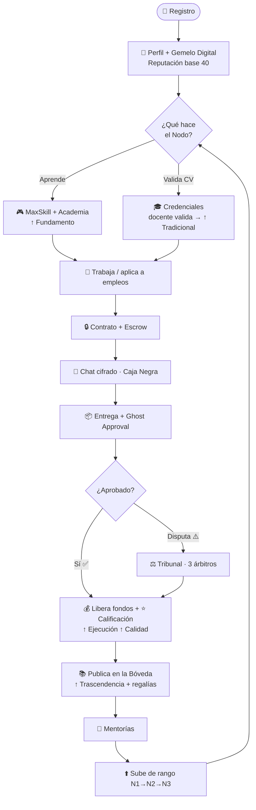
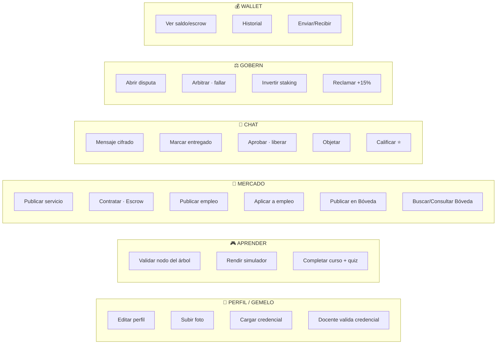

<div align="center">

# ⚡ SISTEMA ÓMICROM ⚡
### Bitácora Maestra · Respaldo Total del Proyecto

`Industria 5.0` · `Capital Intelectual` · `Confianza Cero`


_Última actualización: 27 de junio de 2026_

</div>

---

## 🌐 1. QUÉ ES ÓMICROM

> **Marketplace de capital intelectual donde estudiantes y técnicos construyen una reputación
> verificable e imposible de falsear —el Gemelo Digital— para aprender, demostrar lo que saben
> y ganar trabajo freelance con confianza.**

Rompe el círculo: _"sin experiencia no me contratan → sin que me contraten no gano experiencia"_.

---

## 🧬 2. EL GEMELO DIGITAL (corazón del sistema)

Reputación que **se gana con evidencia real** (fórmula 80/20):

```
REPUTACIÓN = 20% Tradicional  +  80% (promedio de 4 ejes)
```

| Entrada | Se gana con | Conectado |
|--------|-------------|:---------:|
| 🟦 Tradicional | Credenciales validadas por docentes | ✅ |
| 🟩 Fundamento | Dominio del árbol + cursos de Academia | ✅ |
| 🟩 Ejecución | Contratos completados | ✅ |
| 🟩 Calidad | Calificaciones ⭐ de clientes | ✅ |
| 🟩 Trascendencia | Market + Bóveda + Mentorías | ✅ |

---

## 🔄 3. FLUJO DE COMPORTAMIENTO DEL USUARIO



---

## 🆕 ACTUALIZACIÓN v5.0 — JUNIO 2026 (Neo-Académico Holográfico + Blindaje)

> Tanda de **alto impacto** sobre el núcleo ya funcional.

**🎨 Rediseño visual "Neo-Académico Holográfico v5.0"**
- Nueva paleta global (cyan `#00F0FF` · esmeralda `#39FF14` · acero `#005F73` · ámbar `#F59E0B` · void `#020613`). **Eliminado TODO el morado.**
- Cimientos: `tailwind.config.js` + `theme.ts` + `index.css` + nuevo `src/config/omicronTheme.ts`.
- Árbol de Habilidades: **líneas de flujo neón en movimiento**, glassmorphism, candados pulsantes, simulador ámbar premium.
- Bóveda/Mercado: tarjetas **"cajas negras indexadas por IA"** + botones Lock/Unlock neón.
- Gemelo Digital: **poliedro radar 3D holográfico flotante**.
- Gobernanza/Chat: indicadores de estado en **neón líquido** (incl. cronómetro Ghost Approval pulsante).
- Barra superior + sub-pestañas (`HubSubNav`) holográficas.

**🚀 Rendimiento + Robustez**
- **Code-splitting** de las 9 pestañas (`React.lazy`/`Suspense`).
- **ErrorBoundary** global (sin pantallas blancas).
- **PWA instalable** (manifest + service worker network-first + ícono Ω) + **Open Graph/Twitter** para compartir.

**🔒 Seguridad CRÍTICA**
- 🔴→✅ **Runner de código movido a sandbox aislado (Piston)**. Antes corría en el isolate de la Edge Function (exponía `SERVICE_ROLE_KEY` y permitía DoS por bucle infinito). Ahora ejecuta en contenedor efímero externo, con timeout forzado; scoring server-authoritative + nonce anti-spoof.
- 🟡→✅ **Rate limiting real** (`0031_rate_limiting.sql` + `_shared/rateLimit.ts`, fail-open) en `run-code` (20/min), `chat-send` (30/min), `blackbox-open` (15/min) y `embed` (40/min por IP).

**📌 Pendiente de TU acción:** desplegar Edge Functions vía Dashboard y ejecutar la migración `0031`.

---

## ✅ 4. ESTADO ACTUAL — NÚCLEO COMPLETO

| Módulo | Estado |
|--------|:------:|
| Autenticación + Perfiles | ✅ |
| Gemelo Digital (5 entradas conectadas) | ✅ |
| Credenciales + **validación por docentes** | ✅ |
| Foto de perfil + Storage | ✅ |
| Árbol de habilidades (MaxSkill) + simulador | ✅ |
| **Academia** (cursos → quiz → valida nodo → ↑ Fundamento) | ✅ |
| Contratos + Escrow + Ghost Approval | ✅ |
| Chat cifrado (Caja Negra) | ✅ |
| Calificaciones ⭐ | ✅ |
| **Wallet** (saldo, escrow, historial, nodos) | ✅ |
| **Gobernanza** (disputa → 3 árbitros → fallo mueve fondos) | ✅ |
| **Staking** de talento (+15%) | ✅ |
| **Empleos** (publicar + matchmaking 80/20 + terna + aplicar) | ✅ |
| **Bóveda** (publicar / consultar / regalías encadenadas) | ✅ |
| 🧩 **Búsqueda semántica** (pgvector + embeddings gte-small) | ✅ |
| 🧬 **Anti-plagio por Linaje H-07** | ✅ |
| ⏳ **Depreciación H-07** (gracia 30d + suelo 30%) | ✅ |
| Seguridad: RLS, columnas protegidas, **rate limiting real** | ✅ |
| 🔒 **Runner de código en sandbox aislado** (Piston, anti-DoS, sin fuga de secretos) | ✅ |
| 📲 **PWA instalable** + code-splitting + ErrorBoundary | ✅ |
| Tests de reputación (Vitest) | ✅ |
| 🎨 **Identidad visual Neo-Académico Holográfico v5.0** (cyan/esmeralda/acero/ámbar, sin morado) | ✅ |

---

## 🎨 5. IDENTIDAD VISUAL — NEO-ACADÉMICO HOLOGRÁFICO v5.0

```
CYAN:     #00F0FF   (flujos activos, conexiones, energía limpia)
ESMERALDA:#39FF14   (validado, éxito, accesos liberados)
ACERO:    #005F73   (Bóveda / Cajas Negras, jerarquía profunda)
ÁMBAR:    #F59E0B   (alertas, Simulador Contrarreloj, tokens)
VOID:     #020613   (fondo) · GLASS: rgba(8,16,38,0.4) (glassmorphism)
ESTADOS:  rojo #ff5066
```
Regla: glassmorphism + glow neón + movimiento (líneas de flujo, neón líquido). **Sin morado.**

---

## 🚀 6. MEJORAS — MAPA POR CAPAS

### ✅ CAPA 1 — Hecho (realista, alto impacto)
- Búsqueda semántica (pgvector)
- Anti-plagio por linaje (H-07)
- Depreciación con suelo (H-07)
- Matchmaking de empleos (80/20 + terna)
- Validación de credenciales por docentes
- Radar del Gemelo (reputación + desempeño)

### 🟡 CAPA 2 — Con tracción / equipo
- Auditoría de código por IA (Gemini razonamiento) — *cuesta por uso*
- Rutas de aprendizaje generativas
- Proof of Value / tokenización de atención
- Grafo de conocimiento (DeKG) sobre pgvector

### 🔵 CAPA 3 — Investigación / largo plazo
- TEE / Confidential Computing · Zero-Knowledge Proofs
- Biometría conductual (⚠️ legal: Ley 21.719)
- SLMs locales (WebGPU/Wasm) · Enjambres de agentes (Caos)

---

## 💰 7. MODELO ECONÓMICO

**Dos carriles separados (clave legal):**
- 🪙 **Tokens** = puntos internos (gamificación, desbloquear Bóveda). NO son dinero.
- 💵 **Dinero real** = pasarela (Fase 2), con escrow + KYC + boletas.

**Quién paga:** 👥 usuarios (micro-trabajos, Bóveda, premium) y 🏢 empresas (talento validado, premium).
> Los estudiantes casi no pagan; pagan empresas y premium.

---

## 🎯 8. ESTRATEGIA DE LANZAMIENTO

**Nicho:** estudiantes/técnicos de ingeniería que quieren aprender y ganar sus primeras lucas.

**3 canales:**
- 🎓 Universidades → cohortes de estudiantes
- 👨‍🏫 WhatsApp de docentes → ⭐ mentores + **validadores** + árbitros
- 📱 TikTok ingeniería → captación + lista de espera por tandas

**Secuencia:** sembrar docentes (Pioneros) → piloto en 1 ramo → TikTok por tandas.

---

## 🧱 9. STACK TÉCNICO

```
Frontend:  React 18 + TypeScript + Vite + TailwindCSS + theme.ts (Holográfico v5.0) + PWA
Backend:   Supabase (PostgreSQL + RLS + Realtime + Edge Functions + pg_cron)
Vector:    pgvector + Edge Function "embed" (gte-small, 384 dims, gratis)
Auth:      Supabase Auth
Sandbox:   Piston (ejecución aislada de código del simulador, externo a la infra)
Seguridad: RLS, columnas protegidas, rate limiting real, Caja Negra (pgcrypto + Vault)
Pagos:     Tokens internos (Fase 1) → pasarela real (Fase 2)
Deploy:    Vercel (pendiente)
```

---

## 🗓️ 10. ROADMAP

| Semana | Foco | Estado |
|:------:|------|:------:|
| 1 | Estabilización + Academia | ✅ |
| 2 | Wallet + Gobernanza | ✅ |
| 3 | Credenciales + Empleos + Bóveda | ✅ |
| — | Identidad visual Industria 5.0 | ✅ |
| — | Innovaciones (pgvector, linaje, depreciación) | ✅ |
| 4 | Profesionalización (estados, validaciones, tests, performance) | ⬜ |
| 5 | Pre-lanzamiento (legal, onboarding, deploy, beta) | ⬜ |
| 6 | Beta + Lanzamiento 🚀 | ⬜ |

---

<div align="center">

### 🔒 Documentos de respaldo
`DEFINICION_OMICROM.md` · `ESTRATEGIA_LANZAMIENTO.md` · `ROADMAP_LANZAMIENTO.md` · `MATRIZ_TECNOLOGICA.md`

**Sistema Ómicrom — el gemelo digital de tu conocimiento.**

</div>


---

## 🔁 11. FLUJO SEGMENTADO DE TRANSACCIONES

Todas las acciones que un usuario puede realizar, agrupadas por segmento.
_(La semilla `supabase/seed_demo.sql` genera un ejemplo de cada una para verlas en la app.)_



### Detalle por segmento

| Segmento | Transacción | Efecto en el sistema |
|----------|-------------|----------------------|
| 🧬 **Perfil** | Editar perfil / subir foto | Actualiza identidad (avatar en Storage) |
| 🧬 **Perfil** | Cargar credencial | Queda PENDIENTE (o auto-verificada si tiene QR) |
| 🧬 **Perfil** | Docente valida credencial | ✅ VERIFICADA → ↑ **Tradicional** → ↑ Reputación |
| 🎮 **Aprender** | Validar nodo / simulador | ↑ **Fundamento** + PE |
| 🎮 **Aprender** | Completar curso + quiz | Valida nodo → ↑ **Fundamento** |
| 💼 **Mercado** | Publicar servicio | Aparece en el Market |
| 💼 **Mercado** | Contratar (Escrow) | Bloquea tokens del comprador (escrow) |
| 💼 **Mercado** | Publicar empleo | Genera **terna** (matchmaking 80/20) |
| 💼 **Mercado** | Aplicar a empleo | Registra postulación |
| 💼 **Mercado** | Publicar en Bóveda | Doc con embedding + anti-plagio (linaje) |
| 💼 **Mercado** | Consultar Bóveda | Paga tokens → **regalías** al autor (y 20% al original si es derivado) → ↑ **Trascendencia** |
| 💬 **Chat** | Marcar entregado | Inicia Ghost Approval (15 min) |
| 💬 **Chat** | Aprobar (liberar) | Libera escrow al vendedor → ↑ **Ejecución** |
| 💬 **Chat** | Calificar ⭐ | ↑ **Calidad** del vendedor |
| 💬 **Chat** | Objetar | Abre el camino a disputa |
| ⚖️ **Gobern** | Abrir disputa | Asigna **3 árbitros** aleatorios |
| ⚖️ **Gobern** | Arbitrar (fallar) | Mueve fondos (libera/reembolsa) + reputación |
| ⚖️ **Gobern** | Invertir staking | Bloquea tokens en un nodo |
| ⚖️ **Gobern** | Reclamar staking | Devuelve +15% |
| 💰 **Wallet** | Ver saldo / historial | Refleja TODAS las transacciones |
| 💰 **Wallet** | Enviar / Recibir | Transferencia de tokens entre nodos |

> Cada transacción que mueve tokens queda registrada en el **Wallet**, y cada acción que demuestra valor **sube un eje del Gemelo Digital**.
