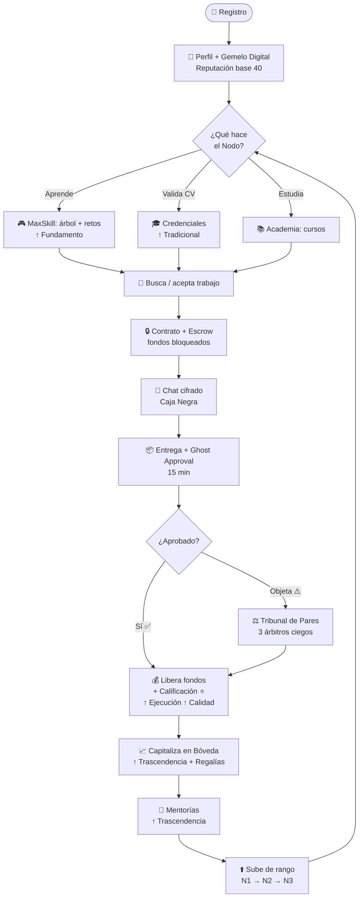

<div align="center">

# ⚡ SISTEMA ÓMICRON ⚡
### Bitácora Maestra · Respaldo Total del Proyecto

`Industria 5.0` · `Capital Intelectual` · `Confianza Cero`


_Última actualización: 27 de junio de 2026_

</div>

---

## 🌐 1. QUÉ ES ÓMICRON

> **Marketplace de capital intelectual donde estudiantes y técnicos construyen una reputación
> verificable e imposible de falsear —el Gemelo Digital— para aprender, demostrar lo que saben
> y ganar trabajo freelance con confianza.**

Rompe el círculo: _"sin experiencia no me contratan → sin que me contraten no gano experiencia"_.

---

## 🧬 2. EL GEMELO DIGITAL (corazón del sistema)

Reputación que **se gana con evidencia real** (fórmula 80/20):

```
REPUTACIÓN = 20% Tradicional  +  80% (promedio de 4 ejes)
```

| Entrada | Se gana con | Estado |
|--------|-------------|:------:|
| 🟦 Tradicional | Credenciales (CV/certificados validados) | ✅ |
| 🟩 Fundamento | Dominio del árbol de habilidades | ✅ |
| 🟩 Ejecución | Contratos completados | ✅ |
| 🟩 Calidad | Calificaciones ⭐ de clientes | ✅ |
| 🟩 Trascendencia | Market + Bóveda + Mentorías | ✅ |

---

## 🔄 3. FLUJO DE COMPORTAMIENTO DEL USUARIO



### El viaje en 3 etapas
1. **🎓 Entrenamiento** — se habilita con el árbol de habilidades y la Academia.
2. **💼 Ejecución** — toma micro-trabajos con contratos inteligentes (Escrow).
3. **📈 Capitalización** — convierte su experiencia en activos de la Bóveda que generan ingreso pasivo.

---

## ✅ 4. ESTADO ACTUAL (lo construido)

| Módulo | Estado |
|--------|:------:|
| Autenticación + Perfiles | ✅ |
| Gemelo Digital (5 entradas conectadas) | ✅ |
| Credenciales + foto de perfil + Storage | ✅ |
| Árbol de habilidades (MaxSkill) + simulador | ✅ |
| Contratos + Escrow + Ghost Approval | ✅ |
| Chat cifrado (Caja Negra) | ✅ |
| Calificaciones ⭐ (rate_contract) | ✅ |
| Reputación 80/20 automática (triggers) | ✅ |
| Mentorías (tabla + Trascendencia) | ✅ |
| Seguridad: RLS, columnas protegidas, rate limiting | ✅ |
| Tests de reputación (Vitest) | ✅ |
| Academia (cursos/quizzes) | ⏳ |
| Gobernanza completa (disputas→resolución) | ⏳ |
| Wallet completo | ⏳ |
| Empleos (matchmaking) | ⏳ |
| Bóveda completa (regalías) | ⏳ |
| Panel validación de credenciales (docentes) | ⏳ |

**Madurez: ~55% de un MVP lanzable.**

---

## 🚀 5. MEJORAS PLANIFICADAS (mapa de innovación por capas)

### 🟢 CAPA 1 — MVP (ahora)
- **Auditoría de Calidad por IA** — Gemini como juez de código en la Academia
- **Proof of Complexity (PoC)** — premia la optimización y elegancia, no la respuesta básica
- **Radar de Redención** — los ejes bajos se muestran como "Disparadores de Redención" (reto de 10 min), no como fallas
- **Siembra Semántica Crítica** — los docentes fundadores indexan las primeras 50 soluciones
- **Telemetría base** — capturar comportamiento al resolver retos (analizar después)

### 🟡 CAPA 2 — Con tracción / financiamiento
- **Depreciación Automática (H-07)** — los activos de la Bóveda pierden valor al volverse obsoletos
- **Regalías Encadenadas** — el valor fluye en cadena a los creadores originales
- **Suelo de Amortización Técnica** — rentabilidad mínima garantizada a nuevos activos
- **Rutas de Aprendizaje Generativas** — el árbol crea micro-retos según las debilidades del Gemelo
- **Feedback de Bucle Inverso** — la IA avisa a los creadores cuando un reto tiene errores masivos

### 🔵 CAPA 3 — Avanzado (Trinidad 5.0)
- **Telemetría de la Intuición** — mapea patrones cognitivos y detecta talento latente ⚠️
- **Biometría Conductual Cognitiva** — el estilo de resolución como firma anti-suplantación ⚠️
- **Minería Semántica Activa** — extrae soluciones valiosas de los chats hacia la Bóveda
- **Ingeniería de Caos** — la IA inyecta fallas para entrenar diagnóstico bajo presión
- **Mapeo de Linaje Semántico** — anti-plagio: un clon se registra como "Hijo" y amarra ingresos al original
- **Tribunal Ciego Criptográfico** — disputas anónimas y aleatorias (anti-colusión)

> ⚠️ **Alerta legal:** Telemetría/Biometría conductual = datos sensibles. Requiere consentimiento
> explícito (Ley 21.719 de datos personales, Chile). Diseñar con cuidado y asesoría legal.

---

## 💰 6. MODELO ECONÓMICO

**Dos carriles separados (clave legal):**
- 🪙 **Tokens** = puntos internos (gamificación, desbloquear Bóveda, destacar). NO son dinero.
- 💵 **Dinero real** = pagos vía pasarela (Fase 2), con escrow + KYC + boletas.

**Quién paga (demanda dual):**
| Paga | Qué |
|------|-----|
| 👥 Usuarios | Micro-trabajos · consultas a la Bóveda · premium |
| 🏢 Empresas | Talento validado · búsqueda por Gemelo · herramientas · premium ← **mejor ingreso** |

**Fuentes de ingreso:** comisión por contrato · suscripción premium · comisión Bóveda + regalías · destacados.

> Los estudiantes (sin recursos) casi no pagan; pagan las **empresas** y el **premium**.

---

## 🗓️ 7. ROADMAP A LANZAMIENTO (ritmo 9 h/día ≈ 6 semanas)

| Semana | Foco |
|:------:|------|
| 1 | Estabilizar (Supabase/404) + Academia |
| 2 | Gobernanza + Wallet |
| 3 | Empleos + Bóveda + validar credenciales |
| 4 | Profesionalización (estados, responsive, tests, seguridad) |
| 5 | Pre-lanzamiento (legal, deploy Vercel, **beta**) |
| 6 | Beta + 🚀 **LANZAMIENTO** |

**Atajo MVP mínimo:** Contratos/Calidad + MaxSkill + legal + deploy → ~2-3 semanas.

---

## 🎯 8. ESTRATEGIA DE LANZAMIENTO (Chile)

**Nicho:** estudiantes/técnicos de ingeniería sin recursos que quieren aprender y ganar lucas.

**3 canales (ventaja injusta):**
- 🎓 Universidades → cohortes de estudiantes
- 👨‍🏫 WhatsApp de docentes → ⭐ mentores + validadores + árbitros
- 📱 TikTok ingeniería → embudo de captación

**Secuencia:** sembrar docentes (Pioneros) → piloto en 1 ramo → TikTok con lista de espera por tandas.

**CORFO:** postular con MVP + tracción (comunidad, docentes, piloto). Verificar convocatorias en `corfo.cl` y `startupchile.org`.

---

## 🧱 9. STACK TÉCNICO

```
Frontend:  React 18 + TypeScript + Vite + TailwindCSS + tema cyberpunk (theme.ts)
Backend:   Supabase (PostgreSQL + RLS + Realtime + Edge Functions)
Auth:      Supabase Auth
Seguridad: RLS, columnas protegidas, rate limiting, Caja Negra (pgcrypto + Vault)
Pagos:     Tokens internos (Fase 1) → pasarela real (Fase 2)
IA:        Gemini (auditoría de código) — Fase 1
Charts:    SVG nativo (ProgressRadar)
Deploy:    Vercel (pendiente)
```

---

<div align="center">

### 🔒 Documentos de respaldo relacionados
`DEFINICION_OMICRON.md` · `ESTRATEGIA_LANZAMIENTO.md` · `ROADMAP_LANZAMIENTO.md`

**Sistema Ómicron — el gemelo digital de tu conocimiento.**

</div>
