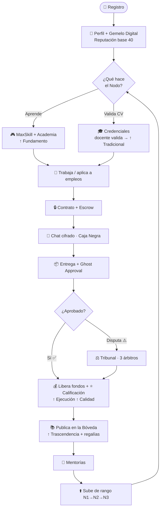
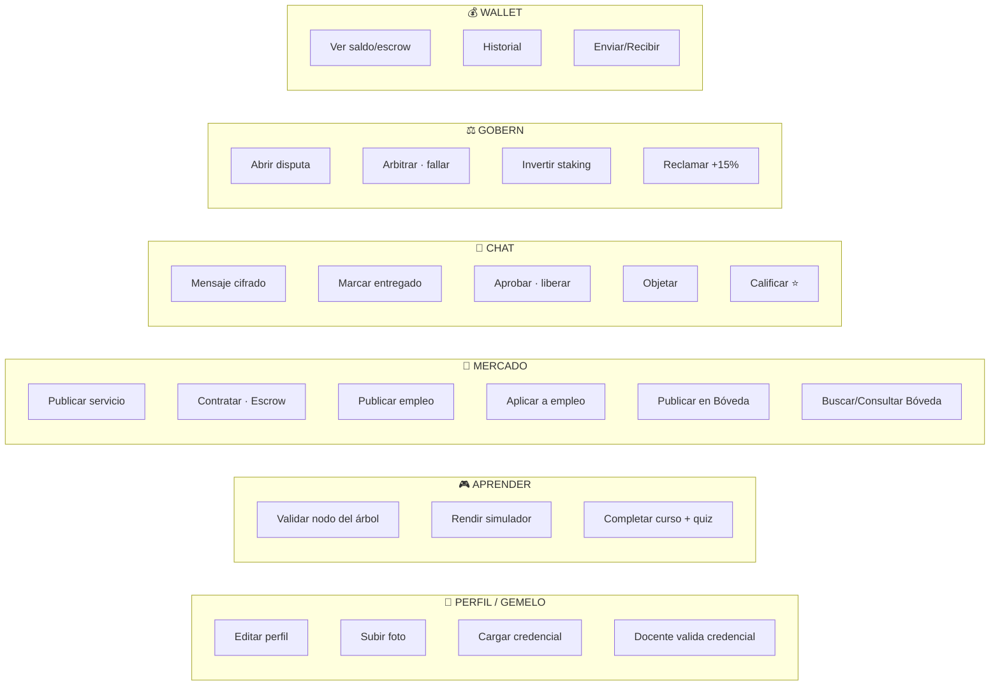

<div align="center">

# ⚡ SISTEMA ÓMICROM ⚡
### Bitácora Maestra · Respaldo Total del Proyecto

`Industria 5.0` · `Capital Intelectual` · `Confianza Cero`


_Última actualización: 7 de julio de 2026 (v7.1 — CI operativo + limpieza)_

</div>

---

## 🌐 1. QUÉ ES ÓMICROM

> **Marketplace de capital intelectual donde estudiantes y técnicos construyen una reputación
> verificable e imposible de falsear —el Gemelo Digital— para aprender, demostrar lo que saben
> y ganar trabajo freelance con confianza.**

Rompe el círculo: _"sin experiencia no me contratan → sin que me contraten no gano experiencia"_.

---

## 🧬 2. EL GEMELO DIGITAL (corazón del sistema)

Reputación que **se gana con evidencia real** (fórmula 80/20):

```
REPUTACIÓN = 20% Tradicional  +  80% (promedio de 4 ejes)
```

| Entrada | Se gana con | Conectado |
|--------|-------------|:---------:|
| 🟦 Tradicional | Credenciales validadas por docentes | ✅ |
| 🟩 Fundamento | Dominio del árbol + cursos de Academia | ✅ |
| 🟩 Ejecución | Contratos completados | ✅ |
| 🟩 Calidad | Calificaciones ⭐ de clientes | ✅ |
| 🟩 Trascendencia | Market + Bóveda + Mentorías | ✅ |

---

## 🔄 3. FLUJO DE COMPORTAMIENTO DEL USUARIO



---

## 🆕 ACTUALIZACIÓN v5.0 — JUNIO 2026 (Neo-Académico Holográfico + Blindaje)

> Tanda de **alto impacto** sobre el núcleo ya funcional.

**🎨 Rediseño visual "Neo-Académico Holográfico v5.0"**
- Nueva paleta global (cyan `#00F0FF` · esmeralda `#39FF14` · acero `#005F73` · ámbar `#F59E0B` · void `#020613`). **Eliminado TODO el morado.**
- Cimientos: `tailwind.config.js` + `theme.ts` + `index.css` (nota histórica: hubo un `src/config/omicronTheme.ts` de referencia, nunca conectado al código; se eliminó en la v7.1 por quedar desactualizado y sin uso).
- Árbol de Habilidades: **líneas de flujo neón en movimiento**, glassmorphism, candados pulsantes, simulador ámbar premium.
- Bóveda/Mercado: tarjetas **"cajas negras indexadas por IA"** + botones Lock/Unlock neón.
- Gemelo Digital: **poliedro radar 3D holográfico flotante**.
- Gobernanza/Chat: indicadores de estado en **neón líquido** (incl. cronómetro Ghost Approval pulsante).
- Barra superior + sub-pestañas (`HubSubNav`) holográficas.

**🚀 Rendimiento + Robustez**
- **Code-splitting** de las 9 pestañas (`React.lazy`/`Suspense`).
- **ErrorBoundary** global (sin pantallas blancas).
- **PWA instalable** (manifest + service worker network-first + ícono Ω) + **Open Graph/Twitter** para compartir.

**🔒 Seguridad CRÍTICA**
- 🔴→✅ **Runner de código movido a sandbox aislado (Piston)**. Antes corría en el isolate de la Edge Function (exponía `SERVICE_ROLE_KEY` y permitía DoS por bucle infinito). Ahora ejecuta en contenedor efímero externo, con timeout forzado; scoring server-authoritative + nonce anti-spoof.
- 🟡→✅ **Rate limiting real** (`0031_rate_limiting.sql` + `_shared/rateLimit.ts`, fail-open) en `run-code` (20/min), `chat-send` (30/min), `blackbox-open` (15/min) y `embed` (40/min por IP).

**📌 Pendiente de TU acción:** desplegar Edge Functions vía Dashboard y ejecutar la migración `0031`.

---

## 🆕 ACTUALIZACIÓN v6.0 — 30 JUNIO 2026 (IA real conectada + Examinador IA)

> Sesión de alto impacto: se conectó la IA de verdad y se rediseñó el corazón del aprendizaje.
> Todo el trabajo quedó en el **PR #1** (rama `fix/coach-academia-simulador`).

**🤖 IA conectada (las 3 funciones de IA operativas)**
- **Coach IA**: se creó el RPC que faltaba `get_coach_context` (migración `0033`) — sin él, el Coach respondía 401.
- **Tutor IA**: nueva Edge Function `tutor` (responde dudas de la lección en la Academia).
- 🔴→✅ **Fix crítico de modelo**: `gemini-1.5-flash` quedó **descontinuado** por Google (error 404). Se actualizó a **`gemini-2.5-flash`** en las 3 funciones (coach, tutor, examen-ia) y se desactivó el "thinking" (`thinkingBudget: 0`) para que no devuelvan respuestas vacías.

**🧠 NUEVO: Simulador → "Examinador IA" adaptativo (el diferencial)**
- El Simulador **deja de ser "escribir código"** y pasa a ser un **examen técnico** universal (sirve para Industria 5.0, Calidad, Procesos, cualquier ingeniería).
- La IA **genera el examen según el nodo y el nivel del usuario** (su Gemelo): opción múltiple + caso aplicado + **defensa** (repregunta anti-memorización).
- Evalúa los **4 ejes** y emite un **ACTA DE EVIDENCIA** auditable (`examen-ia` + migración `0036`: tablas `exam_sessions`, `actas_evidencia`, RPC `aplicar_acta`).
- El acta **actualiza el Gemelo** (mezcla 85/15), valida el nodo y premia PE.

**📜 NUEVO: Dossier de Evidencia (Perfil → Gemelo)**
- Lista las competencias validadas por IA con su desglose de 4 ejes, resumen y fecha. Es la prueba "imposible de falsear" que ve una empresa.

**⚠️ Fix error 400 + UX**
- `academy_courses` corregida (migración `0034`: columnas faltantes + reload PostgREST). Seed de retos `skill_tests` (`0035`).
- **Núcleo del árbol** rediseñado (más grande, halo + anillos) y **árbol responsive** (se ajusta solo al ancho del celular).
- El Examinador ahora **muestra el detalle real del error en pantalla** (sin DevTools).

**📌 Pendiente de TU acción (en el Mac):**
1. `git pull` en la rama del PR.
2. Correr en el SQL Editor las migraciones **`0033`, `0034`, `0035`, `0036`** (o el archivo `supabase/APLICAR_PENDIENTES.sql` para 0033-0035).
3. Poner el secreto **`GEMINI_API_KEY`** (ya hecho) y desplegar: `coach`, `run-code`, `tutor`, `examen-ia`, `carta-ia`.
4. Revisar y **mergear el PR #1** a `main`.

**⚠️ 5. CRÍTICO PARA EL LANZAMIENTO — Activar facturación (billing) de Gemini.**
El plan **gratis** de la API de Gemini tiene un tope muy bajo (**~20 llamadas**), que se agota rápido en pruebas. Con usuarios reales, la IA (Coach, Tutor, Examinador, Carta) **se cortaría**. Hay que activar el **plan pago por uso** en Google AI Studio (el modelo `gemini-2.5-flash` es muy barato — fracciones de centavo por llamada). Ref: https://ai.google.dev/gemini-api/docs/rate-limits
> ✅ Confirmado el 30-jun-2026: todo el ecosistema de IA funciona; lo único que lo frena es este tope del plan gratis.

**💡 Próxima innovación propuesta:** "Carta de Competencias" auto-generada por IA (resumen profesional verificable que lee la empresa, respaldado por las actas).

---

## 🆕 ACTUALIZACIÓN v6.1 — 30 JUNIO 2026 (Sinergia IA en Perfil, Mercado y Bóveda)

> Continuación de la sesión: se llevó la IA a las zonas de valor, todo con sinergia con el Gemelo/Actas.

**📄 Perfil — Carta de Competencias IA** (`carta-ia`)
- La IA lee el Gemelo + las actas y redacta un resumen profesional verificable ("lo que lee una empresa"). Botón en Perfil → Gemelo (copiar/regenerar).

**🛒 Mercado — Mercado de Talento Verificado**
- **Sello de Confianza** en cada tarjeta: reputación (Gemelo) + nº de **competencias validadas por IA** (Actas) + rango. Migración `0037` (contador `competencias_validadas` + `aplicar_acta` lo incrementa).
- **Orden por Confianza** (además de Rating). Tarjetas **compactas** (~3 por pantalla).
- **Asesor IA de Contratación** (`market-match`): describes qué necesitas y la IA recomienda al mejor talento **citando su evidencia**.

**🔮 Bóveda — Oráculo de la Bóveda** (`vault-oracle`)
- Preguntas en lenguaje natural → usa la búsqueda semántica (pgvector) → la IA recomienda **qué conocimiento consultar y por qué** (impulsa las regalías). No expone contenido pagado.

**🎨 Aprender (UI)**
- Núcleo de mayor impacto (halo + anillos) y árbol **responsive** a móviles.

**📌 Pendiente de TU acción (cuando tengas cupo/billing de Gemini):**
1. `git pull`.
2. SQL Editor: migración **`0037`** (contador de competencias).
3. Desplegar Edge Functions nuevas: **`carta-ia`**, **`market-match`**, **`vault-oracle`**.
4. Probar: Carta (Perfil), Asesor IA (Mercado), Oráculo (Bóveda).

> ⚙️ Todas las funciones de IA usan `gemini-2.5-flash` con `thinkingBudget: 0`. Ecosistema IA con sinergia: **Aprender (Examinador) · Perfil (Carta) · Mercado (Asesor) · Bóveda (Oráculo)**.

---

## 🆕 ACTUALIZACIÓN v7.0 — 7 JULIO 2026 (MVP Piloto Controlado + fixes críticos de Auth)

> Sesión enfocada en preparar un **piloto controlado** (interfaz reducida, sin IA visible) y en
> resolver una cadena de bugs de autenticación que bloqueaban por completo el registro/login.
> Todo el trabajo quedó mergeado a `main` en los **PR #2 al #6**.

**🧪 MVP Piloto Controlado** (PR #2 — `mvp/piloto-perfil-academia-empleos`)
- Navegación reducida a **3 pestañas visibles**: Perfil (→ renombrado "Inicio"), Academia, Empleos. Mercado, Billetera y Gobernanza quedan **comentados** (no eliminados) en `config/hubs.ts` para reactivarlos después del piloto con solo descomentar.
- **Todos los botones/paneles de IA ocultos** (comentados, no borrados) en Perfil, Academia y el Simulador de retos: Tutor IA, Coach IA, Carta de Competencias, Dossier de Evidencia (Examinador IA), Copiloto IA. La plataforma luce como un sistema tradicional para el piloto.
- `BottomNav` centrado y proporcionado (antes ocupaba todo el ancho con 5 tabs, ahora 3 tabs de ancho fijo centradas).
- 🔴→✅ **Fix crítico paralelo**: se encontró y eliminó `.env.local.save` (versionado por error en el repo — el `.gitignore` cubre `.env.local` pero no `.env.local.save`). Ese archivo mal nombrado impedía que Vite cargara las variables de Supabase → pantalla en blanco total al correr local.

**🔐 Refactor de seguridad y UX en AuthOverlay** (PR #3 — `fix/auth-overlay-validacion-seguridad`)
- Limpieza automática de todos los campos al alternar entre Login / Registro / Recuperar contraseña.
- Validación estricta: username solo letras/números/`_` (bloqueo en tiempo real), límites de longitud por estándar de industria (email 254 RFC 5321, contraseña 72 = límite efectivo de bcrypt/GoTrue, username 24).
- Contraseña mínima de 8 caracteres (NIST SP 800-63B) + asterisco rojo en todos los campos obligatorios.
- **Mitigación de enumeración de cuentas**: la etiqueta del login pasa de "Email" a **"Usuario"**.
- Todos los mensajes de error de Supabase (en inglés) se traducen al español vía `translateAuthError()`.

**🧭 Reorganización de navegación** (PR #4 — `refactor/nav-home-header-actions`)
- La pestaña "Perfil" pasa a llamarse **"Inicio"** con ícono `Home` (antes `User`).
- **Mensajería** y **Cerrar sesión** se sacan del flujo de Perfil/menú inferior y se reubican como botones en la **barra superior**, junto a la campana de notificaciones — reduce clics para las acciones más usadas.

**♿ Accesibilidad + carga cognitiva** (PR #5 — `a11y/tipografia-filtros-mercado-premium-libre`)
- Tipografía base +8% (`html { font-size: 108% }`) y paleta de colores **oscurecida ~10-15%** en `theme.ts`, `tailwind.config.js`, `index.css` y las paletas locales de Market/Empleos/Habilidades/Examinador — mejora el contraste sobre el fondo oscuro sin depender de zoom del usuario.
- **Mercado**: los filtros (categoría + orden), antes fijos ocupando espacio en pantalla, ahora viven en un **menú lateral tipo hamburguesa** (drawer) — pantalla principal más limpia.
- Títulos jerárquicos agregados a bloques que no los tenían ("Cómo se calcula tu reputación", "Resumen de actividad", "Detalles del nodo", "Desglose de pago").
- 🔓 **Candado Premium desactivado temporalmente** en el Árbol de Habilidades (`MaxSkillTab`) — queda de libre acceso durante el piloto (bypass documentado, reversible con un solo cambio de línea).

**🔴 Fixes críticos de autenticación en base de datos** (PR #6 — `fix/login-usuario-500-signup`)
- **Bug histórico descubierto**: el trigger `handle_new_user()` (de `0001_core.sql`, nunca corregido desde su creación) intentaba insertar una columna `email` en `profiles` que **nunca existió** en el esquema real de producción. Cada registro nuevo abortaba la transacción (`42703`) y Supabase Auth respondía **500** en `/auth/v1/signup` — el registro estuvo roto para todo usuario nuevo hasta este fix.
  - Fix: migración `0040_fix_handle_new_user_email_column.sql` redefine el trigger sin la columna inexistente.
- **Bug derivado del cambio de PR #3**: al cambiar la etiqueta de login a "Usuario", nunca se implementó la resolución real de username → email (Supabase Auth solo autentica por email). Ingresar el username daba `400 Bad Request`.
  - Fix: migración `0041_login_by_username.sql` agrega la RPC `get_email_for_login()` (security definer); `AuthOverlay.tsx` la usa cuando el texto ingresado no tiene forma de email, antes de llamar `signInWithPassword`.

**📌 Pendiente de TU acción (crítico, sin esto el registro/login sigue roto en producción):**
1. Ejecutar en el SQL Editor de Supabase, en orden: **`0040_fix_handle_new_user_email_column.sql`** y **`0041_login_by_username.sql`** (ambas idempotentes).
2. `git pull` en `main` para traer los 5 PRs mergeados de esta sesión.
3. Verificar `.env.local` local (no versionado) con `VITE_SUPABASE_URL` y `VITE_SUPABASE_ANON_KEY` vigentes del dashboard.
4. Probar el flujo completo: registro → login con usuario → login con email → navegación de las 3 pestañas del piloto.

**🩺 Auditoría técnica adicional (no implementada aún, solo diagnóstico):**
Se identificaron 5 malas prácticas recurrentes (uso de `any` en ~8 archivos y 3 Edge Functions, `node_level` con doble tipo texto/entero, `setProfile` sin merge en el canal Realtime, ejecución de código de usuario sin sandbox real en `SimulatorChallenge.tsx`, falta de índices en `messages.network_id`/`blackbox_votes.dispute_id`), inconsistencias de UI (paletas de color duplicadas por archivo en vez de importar de `theme.ts`, botones con mismo rol y estilos distintos) y bugs de navegación (botón "OBJETAR" sin `onClick` en Ghost Approval, spinners sin timeout/cancelar en Examinador y Simulador, sin guarda de "cambios sin guardar" al cambiar de tab). Recomendado: Vitest + ESLint (`typescript-eslint` + `eslint-plugin-react-hooks`, hoy sin config) + GitHub Actions CI. Ninguno de estos puntos se ha corregido todavía — quedan para una futura sesión.

---

## 🆕 ACTUALIZACIÓN v7.1 — 7 JULIO 2026 (CI operativo + limpieza de código muerto)

> Continuación de la sesión v7.0: se puso en marcha el pipeline de calidad (Vitest + ESLint +
> GitHub Actions) recomendado en la auditoría, y se hizo la primera pasada de limpieza de
> código muerto que el usuario sospechaba ("¿tengo dos front, o uno duplicado?").

**⚙️ Vitest + ESLint + GitHub Actions, 100% operativos** (PR #8 al #13)
- Se configuró **Vitest** (`vite.config.ts` con `environment: 'jsdom'`, `globals: true`, `passWithNoTests: true`) y **ESLint 9** (`eslint.config.js`, flat config, con `typescript-eslint` + `eslint-plugin-react-hooks`; reglas `no-explicit-any`/`no-unused-vars` en `warn` para no bloquear el flujo mientras se limpia gradualmente).
- Se agregó el workflow **`.github/workflows/ci.yml`**: corre `typecheck → lint → test → build` en cada Pull Request hacia `main` y en cada push directo. Requiere merge manual del usuario (GitHub bloquea que un agente suba workflows de CI directo a `main` por seguridad).
- **3 bugs reales encontrados y corregidos** al poner en marcha el CI (no relacionados con Vitest/ESLint en sí):
  1. `tsconfig.json` pedía `"types": ["node"]` sin tener `@types/node` como dependencia directa → cambiado a `"types": ["vite/client"]` (patrón estándar Vite+TS; `src/` no usa APIs de Node).
  2. `tsconfig.json` referenciaba `tsconfig.node.json` sin `"composite": true` → se quita la referencia (ya no era necesaria para el typecheck).
  3. `CredentialsPanel.tsx` importaba el ícono `X` sin usarlo → bloqueaba `tsc --noEmit` por `noUnusedLocals: true`.
- **Bug adicional de configuración del CI**: `src/lib/supabase.ts` llama `createClient()` a nivel de módulo; como `reputationService.test.ts` importa esa cadena, el job de Test reventaba con `Error: supabaseUrl is required` al no existir esas variables en GitHub Actions. Fix: se agregan `VITE_SUPABASE_URL`/`VITE_SUPABASE_ANON_KEY` **ficticias** (no secretos reales) como `env` del job — los tests son funciones puras que nunca llaman a Supabase de verdad.
- ✅ Confirmado por el usuario: las 6 corridas de Actions (`typecheck`, `lint`, `test`, `build`) pasan en verde tras estos fixes.

**🧹 Primera limpieza de código muerto**
- El usuario reportó la sensación de tener "dos front, o uno modificado". Se auditó toda la estructura (`src/`, `components/`, configs de build) buscando carpetas duplicadas, componentes huérfanos y archivos de theming en conflicto.
- **Hallazgo confirmado**: `src/config/omicronTheme.ts` era código muerto — documentaba la identidad visual v5.0 pero **ningún componente lo importaba nunca**, y sus colores estaban desincronizados de la paleta real (`theme.ts`), que ya se había oscurecido por accesibilidad en la v7.0. Se **eliminó** el archivo.
- **No se encontraron** carpetas de frontend duplicadas ni componentes huérfanos reales: `SimulatorChallenge.tsx` (reto de redención en Perfil), `ExamenChallenge.tsx` (examen del árbol) y `CourseFlow.tsx` (lecciones dentro de un nodo) suenan parecido pero son 3 features distintas, todas en uso activo — se verificó cada import con búsqueda exhaustiva antes de descartarlos como duplicados.

**📌 Pendiente de TU acción:**
1. `git pull` en `main` para traer los PR #8 al #14 (setup de CI + fixes + limpieza).
2. Seguir el flujo de rama nueva → PR → merge para cualquier cambio futuro (documentado abajo en la sección de Roadmap), aprovechando que el CI ahora valida cada cambio automáticamente.

---

## 🆕 ACTUALIZACIÓN v8.1 — 7 JULIO 2026 (Alineación con Definición Maestra Backend)

> El usuario aportó `DEFINICION_OMICROM_v8_BACKEND.md`, un documento de arquitectura objetivo
> (Gemelo Digital on-chain, Bóveda con regalías encadenadas por profundidad, Justicia con PMC
> y apelaciones, integración Chainlink/Human Passport). Se auditó el esquema real de Supabase
> contra el documento y se cerraron las brechas que **no requieren blockchain** (PR #15).

**🔍 Diagnóstico de brechas (documento vs. esquema real)**
- ✅ **Ya cubierto**: Gemelo Digital (4 ejes, fórmula 80/20), Tokens Ω + escrow, Bóveda con búsqueda semántica (pgvector), disputas con quórum de árbitros (2-de-3), Ghost Approval.
- ⚠️ **Parcial → cerrado en esta actualización**: regalías encadenadas (antes solo 1 nivel fijo al 20%, ahora hasta 3 niveles con decaimiento), penalizaciones (existían columnas sueltas sin tabla ni lógica), apelaciones (`disputes.appellant_id`/`appeal_deposit` existían en el esquema real sin ningún flujo), depreciación de tokens inactivos (solo existía la de contenido de la Bóveda, no la de saldo de usuario).
- ❌ **No existe, fuera de alcance de esta actualización**: Capa On-Chain (SBT Solidity, Chainlink) y Human Passport — requieren stack Web3 nuevo (Hardhat/Solidity/wallets), decisión de red y presupuesto de gas; no se tocó nada de esto todavía.

**⚖️ Justicia: Puntos de Mala Conducta (PMC)** (migración `0042_penalties_pmc.sql`)
- Nueva tabla `penalties` con severidad (`LOW`/`MEDIUM`/`HIGH`/`CRITICAL`) → impacto de reputación y tokens predefinido por escala.
- `resolve_dispute()` ahora **penaliza automáticamente** a quien pierde la disputa por quórum (severidad `MEDIUM` por defecto).
- Recuperación con el tiempo: cron diario decae el PMC vigente ~5%/día tras 30 días de gracia (mismo patrón que la depreciación H-07 de la Bóveda).

**📝 Proceso de apelación real** (migración `0043_appeals.sql`)
- `open_appeal()`: ventana de 7 días desde el fallo, cobra depósito de tokens.
- Panel de 3 **árbitros senior** — como el sistema real usa `node_type` (Operativo/Core/Arquitecto/Fundador) + reputación en vez de niveles N1-N6, se definió el proxy: `node_type IN ('Nodo Arquitecto','Nodo Fundador') AND reputation_score >= 70`.
- `resolve_appeal()`: quórum 2-de-3. Si se confirma (`UPHOLD`) se pierde el depósito; si se revierte (`OVERTURN`) se devuelve el depósito, se revierte el movimiento de escrow y se ajusta el PMC del nuevo perdedor/ganador.

**📚 Bóveda: regalías encadenadas a 3 niveles** (migración `0044_vault_chained_royalties.sql`)
- Nueva tabla `content_lineage` (reemplaza la limitación de `parent_document_id` a un solo nivel; se migra automáticamente el linaje ya existente).
- `register_content_lineage()`: registra derivación cuando la similitud semántica es ≥ 85% (usa `find_similar_documents()` ya existente de `0025_vault_semantic.sql`).
- `consult_vault_document()` redefinida: recorre la cadena de linaje hasta 3 niveles, aplicando la fórmula exacta del documento `Regalía = Ingreso × (20% × 0.75^Profundidad)` → 15% / 11.25% / 8.4375% para los niveles 1/2/3.

**🪙 Depreciación de Tokens Ω inactivos** (migración `0045_token_depreciation.sql`)
- Nueva columna `profiles.last_activity_at`, refrescada automáticamente por triggers en Bóveda, Wallet y Contratos (antes no existía una marca de actividad real; `updated_at` se pisaba con cualquier cambio administrativo).
- Cron mensual: **5% de depreciación** sobre `token_balance` (nunca sobre `token_escrow`, que es dinero comprometido en contratos activos) para usuarios sin actividad en más de 90 días.

**📌 Pendiente de TU acción:**
1. Ejecutar en el SQL Editor de Supabase, en orden: **`0042_penalties_pmc.sql`**, **`0043_appeals.sql`**, **`0044_vault_chained_royalties.sql`**, **`0045_token_depreciation.sql`**.
2. Estas 4 migraciones son **solo backend/SQL** — no hay UI nueva todavía para ver penalizaciones o abrir apelaciones desde la app. Evaluar en una próxima sesión si se necesita pantalla nueva.
3. Decisión pendiente (no bloqueante): si más adelante se quiere avanzar con la Capa On-Chain (SBT + Chainlink) del documento v8.1, es scope nuevo grande (Solidity, red, gas, wallets) — requiere sesión dedicada.

---

## ✅ 4. ESTADO ACTUAL — NÚCLEO COMPLETO

| Módulo | Estado |
|--------|:------:|
| Autenticación + Perfiles | ✅ |
| Gemelo Digital (5 entradas conectadas) | ✅ |
| Credenciales + **validación por docentes** | ✅ |
| Foto de perfil + Storage | ✅ |
| Árbol de habilidades (MaxSkill) + simulador | ✅ |
| **Academia** (cursos → quiz → valida nodo → ↑ Fundamento) | ✅ |
| 🤖 **Coach IA / Tutor IA** (Gemini 2.5-flash) | ✅ |
| 🧠 **Examinador IA** (examen técnico adaptativo → Acta de Evidencia) | ✅ |
| 📜 **Dossier de Evidencia** (Perfil → Gemelo) | ✅ |
| Contratos + Escrow + Ghost Approval | ✅ |
| Chat cifrado (Caja Negra) | ✅ |
| Calificaciones ⭐ | ✅ |
| **Wallet** (saldo, escrow, historial, nodos) | ✅ |
| **Gobernanza** (disputa → 3 árbitros → fallo mueve fondos) | ✅ |
| **Staking** de talento (+15%) | ✅ |
| **Empleos** (publicar + matchmaking 80/20 + terna + aplicar) | ✅ |
| **Bóveda** (publicar / consultar / regalías encadenadas hasta 3 niveles) | ✅ |
| 🧩 **Búsqueda semántica** (pgvector + embeddings gte-small) | ✅ |
| 🧬 **Anti-plagio por Linaje H-07** (`content_lineage`, ≥85% similitud) | ✅ |
| ⏳ **Depreciación H-07** (gracia 30d + suelo 30%) | ✅ |
| ⚖️ **Penalizaciones PMC** (severidad → reputación/tokens, recuperación con el tiempo) | ✅ |
| 📝 **Proceso de apelación** (ventana 7d, panel senior, quórum 2-de-3) | ✅ |
| 🪙 **Depreciación de tokens inactivos** (5% mensual, >90 días sin actividad) | ✅ |
| Seguridad: RLS, columnas protegidas, **rate limiting real** | ✅ |
| 🔒 **Runner de código en sandbox aislado** (Piston, anti-DoS, sin fuga de secretos) | ✅ |
| 📲 **PWA instalable** + code-splitting + ErrorBoundary | ✅ |
| Tests de reputación (Vitest) | ✅ |
| 🎨 **Identidad visual Neo-Académico Holográfico v5.0** (cyan/esmeralda/acero/ámbar, sin morado) | ✅ |
| 🧪 **MVP Piloto Controlado** (3 pestañas, IA oculta, tipografía/contraste a11y) | ✅ |
| 🔐 Registro y login (con usuario o email) — migraciones 0040/0041 aplicadas | ✅ |
| ⚙️ **CI (Vitest + ESLint + GitHub Actions)** — typecheck/lint/test/build en cada PR | ✅ |

> ⚠️ **Estado temporal de piloto:** Mercado, Billetera, Gobernanza y todas las funciones de IA
> están **ocultas** (comentadas, no eliminadas) de la interfaz mientras dure el piloto controlado.
> Se reactivan descomentando `config/hubs.ts` y los bloques marcados `🧪 MVP PILOTO CONTROLADO`.

---

## 🎨 5. IDENTIDAD VISUAL — NEO-ACADÉMICO HOLOGRÁFICO v5.0

```
CYAN:     #00F0FF   (flujos activos, conexiones, energía limpia)
ESMERALDA:#39FF14   (validado, éxito, accesos liberados)
ACERO:    #005F73   (Bóveda / Cajas Negras, jerarquía profunda)
ÁMBAR:    #F59E0B   (alertas, Simulador Contrarreloj, tokens)
VOID:     #020613   (fondo) · GLASS: rgba(8,16,38,0.4) (glassmorphism)
ESTADOS:  rojo #ff5066
```
Regla: glassmorphism + glow neón + movimiento (líneas de flujo, neón líquido). **Sin morado.**

---

## 🚀 6. MEJORAS — MAPA POR CAPAS

### ✅ CAPA 1 — Hecho (realista, alto impacto)
- Búsqueda semántica (pgvector)
- Anti-plagio por linaje (H-07)
- Depreciación con suelo (H-07)
- Matchmaking de empleos (80/20 + terna)
- Validación de credenciales por docentes
- Radar del Gemelo (reputación + desempeño)

### 🟡 CAPA 2 — Con tracción / equipo
- Auditoría de código por IA (Gemini razonamiento) — *cuesta por uso*
- Rutas de aprendizaje generativas
- Proof of Value / tokenización de atención
- Grafo de conocimiento (DeKG) sobre pgvector

### 🔵 CAPA 3 — Investigación / largo plazo
- TEE / Confidential Computing · Zero-Knowledge Proofs
- Biometría conductual (⚠️ legal: Ley 21.719)
- SLMs locales (WebGPU/Wasm) · Enjambres de agentes (Caos)

---

## 💰 7. MODELO ECONÓMICO

**Dos carriles separados (clave legal):**
- 🪙 **Tokens** = puntos internos (gamificación, desbloquear Bóveda). NO son dinero.
- 💵 **Dinero real** = pasarela (Fase 2), con escrow + KYC + boletas.

**Quién paga:** 👥 usuarios (micro-trabajos, Bóveda, premium) y 🏢 empresas (talento validado, premium).
> Los estudiantes casi no pagan; pagan empresas y premium.

---

## 🎯 8. ESTRATEGIA DE LANZAMIENTO

**Nicho:** estudiantes/técnicos de ingeniería que quieren aprender y ganar sus primeras lucas.

**3 canales:**
- 🎓 Universidades → cohortes de estudiantes
- 👨‍🏫 WhatsApp de docentes → ⭐ mentores + **validadores** + árbitros
- 📱 TikTok ingeniería → captación + lista de espera por tandas

**Secuencia:** sembrar docentes (Pioneros) → piloto en 1 ramo → TikTok por tandas.

---

## 🧱 9. STACK TÉCNICO

```
Frontend:  React 18 + TypeScript + Vite + TailwindCSS + theme.ts (Holográfico v5.0) + PWA
Backend:   Supabase (PostgreSQL + RLS + Realtime + Edge Functions + pg_cron)
Vector:    pgvector + Edge Function "embed" (gte-small, 384 dims, gratis)
Auth:      Supabase Auth
Sandbox:   Piston (ejecución aislada de código del simulador, externo a la infra)
Seguridad: RLS, columnas protegidas, rate limiting real, Caja Negra (pgcrypto + Vault)
Pagos:     Tokens internos (Fase 1) → pasarela real (Fase 2)
Deploy:    Vercel (pendiente)
```

---

## 🗓️ 10. ROADMAP

| Semana | Foco | Estado |
|:------:|------|:------:|
| 1 | Estabilización + Academia | ✅ |
| 2 | Wallet + Gobernanza | ✅ |
| 3 | Credenciales + Empleos + Bóveda | ✅ |
| — | Identidad visual Industria 5.0 | ✅ |
| — | Innovaciones (pgvector, linaje, depreciación) | ✅ |
| 4 | Profesionalización (estados, validaciones, tests, performance) | ⬜ |
| — | **MVP Piloto Controlado** (nav reducida, IA oculta, a11y, fixes de Auth) | ✅ |
| — | **CI operativo** (Vitest + ESLint + GitHub Actions) + limpieza de código muerto | ✅ |
| — | **Alineación v8.1**: PMC, apelaciones, regalías encadenadas 3 niveles, depreciación de tokens | ✅ |
| — | Capa On-Chain (SBT Solidity + Chainlink) + Human Passport — scope nuevo, no iniciado | ⬜ |
| 5 | Pre-lanzamiento (legal, onboarding, deploy Vercel, **billing Gemini**, beta) | ⬜ |
| 6 | Beta + Lanzamiento 🚀 | ⬜ |

---

<div align="center">

### 🔒 Documentos de respaldo
`DEFINICION_OMICROM.md` · `ESTRATEGIA_LANZAMIENTO.md` · `ROADMAP_LANZAMIENTO.md` · `MATRIZ_TECNOLOGICA.md`

**Sistema Ómicrom — el gemelo digital de tu conocimiento.**

</div>


---

## 🔁 11. FLUJO SEGMENTADO DE TRANSACCIONES

Todas las acciones que un usuario puede realizar, agrupadas por segmento.
_(La semilla `supabase/seed_demo.sql` genera un ejemplo de cada una para verlas en la app.)_



### Detalle por segmento

| Segmento | Transacción | Efecto en el sistema |
|----------|-------------|----------------------|
| 🧬 **Perfil** | Editar perfil / subir foto | Actualiza identidad (avatar en Storage) |
| 🧬 **Perfil** | Cargar credencial | Queda PENDIENTE (o auto-verificada si tiene QR) |
| 🧬 **Perfil** | Docente valida credencial | ✅ VERIFICADA → ↑ **Tradicional** → ↑ Reputación |
| 🎮 **Aprender** | Validar nodo / simulador | ↑ **Fundamento** + PE |
| 🎮 **Aprender** | Completar curso + quiz | Valida nodo → ↑ **Fundamento** |
| 💼 **Mercado** | Publicar servicio | Aparece en el Market |
| 💼 **Mercado** | Contratar (Escrow) | Bloquea tokens del comprador (escrow) |
| 💼 **Mercado** | Publicar empleo | Genera **terna** (matchmaking 80/20) |
| 💼 **Mercado** | Aplicar a empleo | Registra postulación |
| 💼 **Mercado** | Publicar en Bóveda | Doc con embedding + anti-plagio (linaje) |
| 💼 **Mercado** | Consultar Bóveda | Paga tokens → **regalías** al autor (y 20% al original si es derivado) → ↑ **Trascendencia** |
| 💬 **Chat** | Marcar entregado | Inicia Ghost Approval (15 min) |
| 💬 **Chat** | Aprobar (liberar) | Libera escrow al vendedor → ↑ **Ejecución** |
| 💬 **Chat** | Calificar ⭐ | ↑ **Calidad** del vendedor |
| 💬 **Chat** | Objetar | Abre el camino a disputa |
| ⚖️ **Gobern** | Abrir disputa | Asigna **3 árbitros** aleatorios |
| ⚖️ **Gobern** | Arbitrar (fallar) | Mueve fondos (libera/reembolsa) + reputación |
| ⚖️ **Gobern** | Invertir staking | Bloquea tokens en un nodo |
| ⚖️ **Gobern** | Reclamar staking | Devuelve +15% |
| 💰 **Wallet** | Ver saldo / historial | Refleja TODAS las transacciones |
| 💰 **Wallet** | Enviar / Recibir | Transferencia de tokens entre nodos |

> Cada transacción que mueve tokens queda registrada en el **Wallet**, y cada acción que demuestra valor **sube un eje del Gemelo Digital**.
